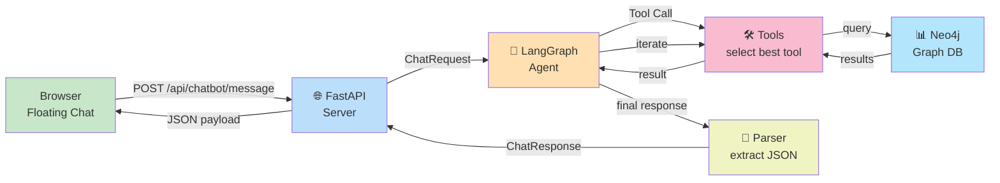
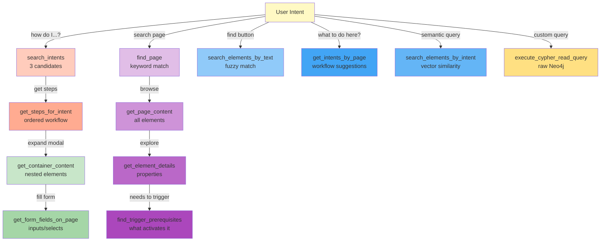
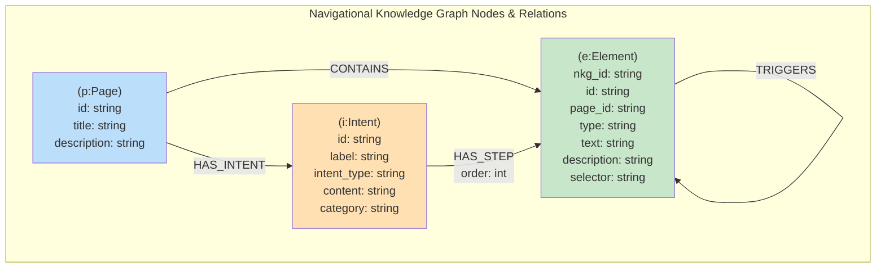
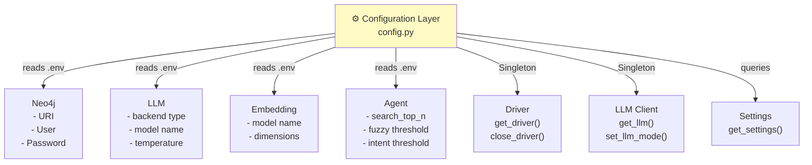
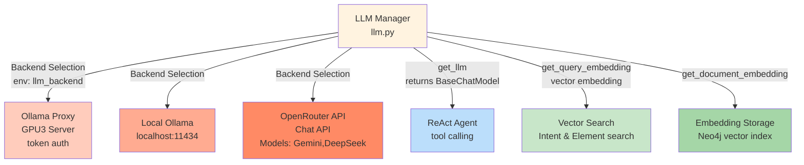
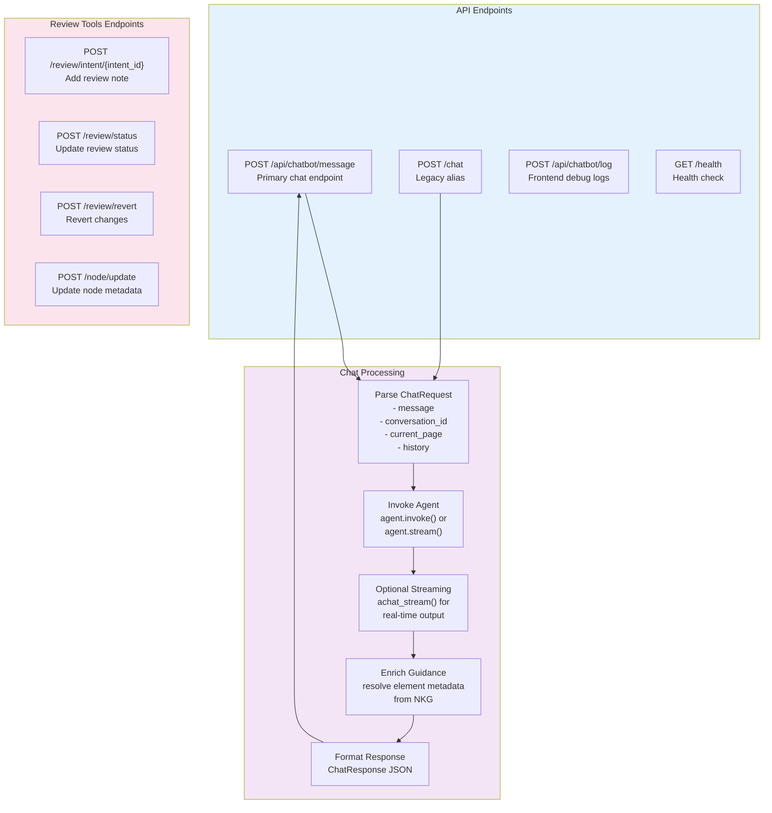

# In-App Navigational Agent - Complete Architecture

## Agent & Tools Structure

```mermaid
graph TB
    subgraph API["🌐 FastAPI Server Layer"]
        SERVER["FastAPI Server<br/>- /api/chatbot/message<br/>- /chat<br/>- /api/chatbot/log<br/>- /health"]
        REQ["Request Handler<br/>ChatRequest<br/>conversation_id<br/>current_page<br/>history"]
        RESP["Response Handler<br/>ChatResponse<br/>- message<br/>- type<br/>- guidance<br/>- tools_used"]
    end

    subgraph AGENT["🤖 LangGraph ReAct Agent"]
        AGENT_CORE["create_agent()"]
        SYSTEM["System Prompt<br/>SYSTEM_PROMPT"]
        REFORMAT["Response Parser<br/>parse_agent_response()<br/>JSON extraction"]
    end

    subgraph TOOLS["🛠️ Tool Suite - 12 Tools"]
        subgraph INTENT_TOOLS["Intent Discovery"]
            T1["search_intents<br/>Semantic search intent candidates"]
            T2["get_steps_for_intent<br/>Fetch ordered workflow steps"]
            T3["get_intents_by_page<br/>List intents on page"]
        end

        subgraph ELEMENT_TOOLS["Element Search & Details"]
            T4["search_elements_by_intent<br/>Vector search UI elements"]
            T5["search_elements_by_text<br/>Fuzzy text matching"]
            T6["get_element_details<br/>Element properties & triggers"]
            T7["find_trigger_prerequisites<br/>Find elements that trigger this"]
        end

        subgraph PAGE_TOOLS["Page Navigation"]
            T8["find_page<br/>Search page by keyword"]
            T9["get_page_content<br/>All elements on page"]
            T10["get_container_content<br/>Nested container elements"]
            T11["get_form_fields_on_page<br/>Form controls on page"]
        end

        subgraph UTILITY_TOOLS["Utility"]
            T12["execute_cypher_read_query<br/>Direct Neo4j access"]
        end
    end

    subgraph CORE["⚙️ Core Layer"]
        CONFIG["Config<br/>get_settings()<br/>- Neo4j URI<br/>- LLM backend<br/>- Models<br/>- Thresholds"]
        LLM["LLM Manager<br/>get_llm()<br/>- Ollama Proxy<br/>- Local Ollama<br/>- OpenRouter API<br/>get_query_embedding"]
        GRAPHDB["Graph Database Layer<br/>get_driver()<br/>- _run_read()<br/>- Cypher queries"]
    end

    subgraph EXT["🔌 External Services"]
        NEO4J["Neo4j Database<br/>Navigational Knowledge Graph<br/>Nodes: Page, Element, Intent<br/>Relations: CONTAINS, TRIGGERS, HAS_STEP"]
        LLM_SVC["LLM Services<br/>- Ollama GPU3 Proxy<br/>- Local Ollama<br/>- OpenRouter<br/>Models: Gemma4, DeepSeek-R1"]
    end

    %% Connections - API Layer
    SERVER --> REQ
    REQ --> AGENT_CORE
    AGENT_CORE --> SYSTEM
    AGENT_CORE --> REFORMAT
    REFORMAT --> RESP

    %% Connections - Agent to Tools
    AGENT_CORE -->|call| T1
    AGENT_CORE -->|call| T2
    AGENT_CORE -->|call| T3
    AGENT_CORE -->|call| T4
    AGENT_CORE -->|call| T5
    AGENT_CORE -->|call| T6
    AGENT_CORE -->|call| T7
    AGENT_CORE -->|call| T8
    AGENT_CORE -->|call| T9
    AGENT_CORE -->|call| T10
    AGENT_CORE -->|call| T11
    AGENT_CORE -->|call| T12

    %% Connections - Tools to Core
    T1 --> LLM
    T1 --> GRAPHDB
    T2 --> GRAPHDB
    T3 --> GRAPHDB
    T4 --> LLM
    T4 --> GRAPHDB
    T5 --> GRAPHDB
    T5 --> CONFIG
    T6 --> GRAPHDB
    T7 --> GRAPHDB
    T8 --> GRAPHDB
    T9 --> GRAPHDB
    T10 --> GRAPHDB
    T11 --> GRAPHDB
    T12 --> GRAPHDB

    %% Connections - Core to External
    LLM --> LLM_SVC
    GRAPHDB --> NEO4J
    CONFIG -.->|read| CONFIG
    
    style API fill:#e1f5ff
    style AGENT fill:#fff3e0
    style TOOLS fill:#f3e5f5
    style CORE fill:#e8f5e9
    style EXT fill:#fce4ec
    style INTENT_TOOLS fill:#ffe0b2
    style ELEMENT_TOOLS fill:#f8bbd0
    style PAGE_TOOLS fill:#c5e1a5
    style UTILITY_TOOLS fill:#b3e5fc
```

## Data Flow - Complete Request/Response Cycle

## Tool Interaction Map

## Neo4j Knowledge Graph Schema

## Core Layer - Configuration & Initialization

## LLM Integration Points

## API Server Endpoints & Workflows

---

## Summary Statistics

| Component | Count | Details |
|-----------|-------|---------|
| **Tools** | 12 | Intent Discovery (3), Element Search (4), Page Navigation (4), Utility (1) |
| **Intent Tools** | 3 | search_intents, get_steps_for_intent, get_intents_by_page |
| **Element Tools** | 4 | search_elements_by_intent, search_elements_by_text, get_element_details, find_trigger_prerequisites |
| **Page Tools** | 4 | find_page, get_page_content, get_container_content, get_form_fields_on_page |
| **Utility Tools** | 1 | execute_cypher_read_query |
| **Core Modules** | 4 | config.py, llm.py, graph_db.py, |
| **API Endpoints** | 7 | /api/chatbot/message, /chat, /health, /api/chatbot/log, + review endpoints |
| **Neo4j Node Types** | 3 | Page, Element, Intent |
| **Neo4j Relationship Types** | 4 | CONTAINS, TRIGGERS, HAS_STEP, HAS_INTENT |
| **LLM Backends** | 3 | Ollama Proxy, Local Ollama, OpenRouter |

