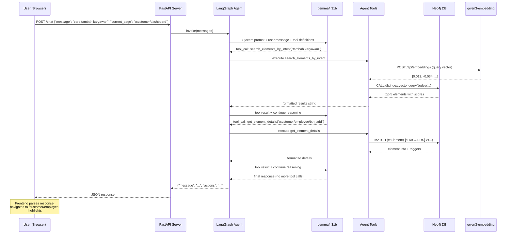

# 01 — Architecture Overview

## System Context

The In-App Navigational AI Agent sits between the **user** (via a floating chat widget in the SaaS admin panel) and the **Navigational Knowledge Graph** (NKG) stored in Neo4j. It does **not** execute actions — it **guides** the user by:

1. Understanding their intent via natural language
2. Finding the relevant UI elements in the knowledge graph
3. Returning step-by-step instructions with CSS selectors for DOM highlighting

---

## High-Level Architecture

```
┌─────────────────────────────────────────────────────────────────┐
│                     SaaS Admin Panel (Browser)                  │
│  ┌──────────────────────────────────────────────────────────┐   │
│  │  Floating Chat Widget (HTML/CSS/JS)                      │   │
│  │  ┌──────────────────┐  ┌─────────────────────────────┐  │   │
│  │  │  Chat UI          │  │  DOM Manipulator            │  │   │
│  │  │  - Text input     │  │  - Highlight elements       │  │   │
│  │  │  - Message list   │  │  - Auto-scroll to target    │  │   │
│  │  │  - Send button    │  │  - Inject CSS overlays      │  │   │
│  │  └────────┬─────────┘  └──────────┬──────────────────┘  │   │
│  │           │ POST /chat             ▲ actions[]           │   │
│  └───────────┼────────────────────────┼─────────────────────┘   │
└──────────────┼────────────────────────┼─────────────────────────┘
               │                        │
               ▼                        │
┌──────────────────────────────────────────────────────────────────┐
│                    NKG Agent Backend (Python)                     │
│                                                                   │
│  ┌────────────────────────────────────────────────────────────┐  │
│  │  FastAPI Server (server.py)                                │  │
│  │  POST /chat  →  {"message": "...", "current_page": "..."}  │  │
│  └────────────────────────┬───────────────────────────────────┘  │
│                           │                                      │
│  ┌────────────────────────▼───────────────────────────────────┐  │
│  │  LangGraph ReAct Agent (agent.py)                          │  │
│  │                                                             │  │
│  │  ┌─────────┐    ┌──────────┐    ┌─────────┐               │  │
│  │  │  START   │───▶│   LLM    │───▶│  END    │               │  │
│  │  └─────────┘    │ gemma4   │    └─────────┘               │  │
│  │                  │  :31b    │                               │  │
│  │                  └────┬─────┘                               │  │
│  │                       │ tool_calls?                         │  │
│  │                       ▼                                     │  │
│  │                  ┌──────────┐                               │  │
│  │                  │  TOOLS   │                               │  │
│  │                  │  node    │──── loops back to LLM ────┐  │  │
│  │                  └──────────┘                            │  │  │
│  │                       │                                  │  │  │
│  │    ┌──────────────────┼──────────────────────────┐      │  │  │
│  │    │                  │                           │      │  │  │
│  │    ▼                  ▼                           ▼      │  │  │
│  │ semantic_search  page_content  element_details         │  │  │
│  │ find_page        text_search                           │  │  │
│  │                                                         │  │  │
│  └─────────────────────────────────────────────────────────┘  │  │
│                           │                                      │
│  ┌────────────────────────▼───────────────────────────────────┐  │
│  │  Infrastructure Layer                                      │  │
│  │                                                             │  │
│  │  ┌─────────────┐  ┌──────────────┐  ┌──────────────────┐  │  │
│  │  │  graph_db.py │  │   llm.py     │  │   config.py      │  │  │
│  │  │  Neo4j       │  │  ChatOllama  │  │  .env settings   │  │  │
│  │  │  driver      │  │  + Embedding │  │                  │  │  │
│  │  └──────┬──────┘  └──────┬───────┘  └──────────────────┘  │  │
│  └─────────┼────────────────┼────────────────────────────────┘  │
└────────────┼────────────────┼────────────────────────────────────┘
             │                │
             ▼                ▼
     ┌───────────────┐  ┌──────────────────────────┐
     │   Neo4j DB    │  │  Ollama Proxy Server     │
     │  bolt://7687  │  │  youtube.com             │
     │               │  │                          │
     │  60 Pages     │  │  gemma4:31b (chat)       │
     │  4365 Elements│  │  qwen3-embedding:8b      │
     │  HNSW Index   │  │                          │
     └───────────────┘  └──────────────────────────┘
```

---

## Data Flow — Single User Query



---

## Design Principles

### 1. Separation of Concerns
Each module has exactly one responsibility:
- `config.py` — settings loading
- `llm.py` — LLM/embedding client
- `graph_db.py` — database queries
- `tools/` — agent-facing tool wrappers
- `agent.py` — orchestration logic
- `prompts.py` — prompt engineering
- `server.py` — HTTP interface

### 2. Tools as the Single Source of Truth
The agent **never fabricates** element IDs or selectors. Every piece of UI information comes from a tool call that hits Neo4j. The system prompt enforces this.

### 3. Pluggable Architecture
When `Intent` and `HAS_STEP` nodes are added to Neo4j later:
- Add one new file: `tools/workflow.py` with a `get_workflow_by_intent` tool
- Register it in the agent's tool list
- Zero changes to existing code

### 4. Thin API Layer
The FastAPI server is intentionally thin — it translates HTTP to agent invocations and back. All intelligence lives in the LangGraph agent.

---

## Agent Loop — ReAct Pattern

The LangGraph agent uses the **ReAct** (Reasoning + Acting) pattern:

```
LOOP:
  1. LLM receives: system prompt + message history + available tools
  2. LLM decides: call a tool OR produce final answer
  3. IF tool call:
     a. Execute the tool function
     b. Append tool result to message history
     c. Go to step 1
  4. IF final answer:
     a. Return the response
     b. EXIT loop
```

This is implemented by `langgraph.prebuilt.create_react_agent`, which builds a `StateGraph` with two nodes (`agent` and `tools`) and conditional edges.

### Why ReAct over Plan-and-Execute?

- **Simpler**: No separate planning step needed for navigational queries
- **Adaptive**: The agent can course-correct after seeing tool results (e.g., "that element doesn't exist, let me search differently")
- **Proven**: Well-tested pattern for tool-calling agents with structured knowledge bases
- **Built-in**: LangGraph has a prebuilt implementation, reducing custom code

---

## Future Extension Points

| Extension | How to Add | Effort |
|:----------|:-----------|:-------|
| `Intent` + `HAS_STEP` support | New tool in `tools/workflow.py` | Low |
| Streaming responses | `astream_events()` + FastAPI `StreamingResponse` | Medium |
| Persistent memory | `Neo4jSaver` or Redis checkpointer | Medium |
| Multi-turn context | Already supported via message history in agent state | Built-in |
| n8n webhook layer | n8n HTTP node → FastAPI `/chat` | Low |
| Additional LLM models | Change `LLM_MODEL` in `.env` | Trivial |
