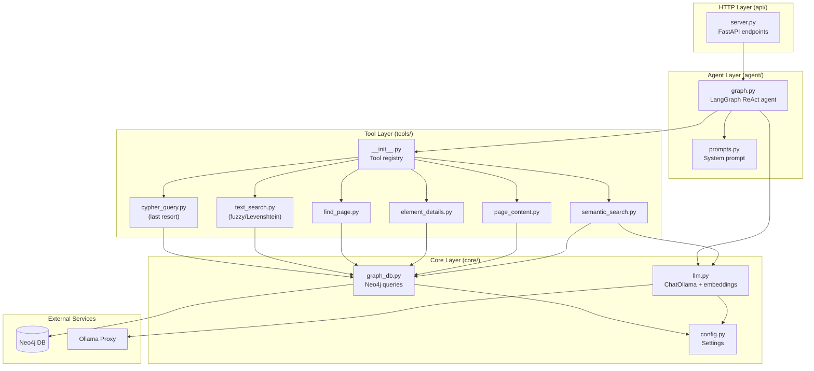

# 03 — Project Structure

## Directory Layout

```
llm_based_agent/
├── .env                              # Secrets (Neo4j, Ollama proxy) — NOT committed
├── pyproject.toml                    # Project metadata + dependencies
│
├── src/
│   └── nkg_agent/                    # Main package
│       ├── __init__.py               # Package init, version
│       │
│       ├── core/                     # ── Infrastructure layer ──
│       │   ├── __init__.py
│       │   ├── config.py             # Pydantic Settings from .env
│       │   ├── llm.py                # ChatOllama + embedding client
│       │   └── graph_db.py           # Neo4j driver + query helpers
│       │
│       ├── tools/                    # ── Agent-facing tools ──
│       │   ├── __init__.py           # Exports ALL_TOOLS list
│       │   ├── semantic_search.py    # Vector similarity search
│       │   ├── page_content.py       # Get all elements on a page
│       │   ├── element_details.py    # Element info + triggers
│       │   ├── find_page.py          # Search pages by title
│       │   ├── text_search.py        # Fuzzy inner text search (Levenshtein)
│       │   └── cypher_query.py       # Last-resort read-only Cypher execution
│       │
│       ├── agent/                    # ── Agent logic ──
│       │   ├── __init__.py
│       │   ├── prompts.py            # System prompt constants
│       │   └── graph.py              # LangGraph ReAct agent definition
│       │
│       └── api/                      # ── HTTP layer ──
│           ├── __init__.py
│           └── server.py             # FastAPI app with /chat and /health
│
├── cli.py                            # [NEW] Interactive CLI chat loop for testing
│
├── docs/                             # Documentation
│   ├── neo4j_schema.md               # DB schema reference
│   └── implementation_plan/          # This documentation suite
│       ├── README.md
│       ├── 01_architecture.md
│       ├── 02_tech_stack.md
│       ├── 03_project_structure.md
│       ├── 04_components.md
│       ├── 05_agent_tools.md
│       ├── 06_agent_and_prompts.md
│       ├── 07_api_server.md
│       └── 08_verification.md
│
├── tests/                            # Test directory (later phase)
│   ├── __init__.py
│   └── conftest.py                   # Shared fixtures
│
└── 1_try_embedding.ipynb             # Existing experiment notebook
```

---

## Module Responsibility Map



---

## Module Dependencies (Import Graph)

```
core/config.py         → (no internal deps, reads .env)
core/llm.py            → core/config.py
core/graph_db.py       → core/config.py
tools/*                → core/graph_db.py, core/llm.py
agent/prompts.py       → (no deps, pure constants)
agent/graph.py         → core/llm.py, tools/__init__.py, agent/prompts.py
api/server.py          → agent/graph.py, core/config.py, core/graph_db.py
cli.py                 → agent/graph.py
```

**Rule:** No circular imports. Dependencies flow downward only.

---

## Design Rationale

### Why `core/`, `tools/`, `agent/`, `api/` subdirectories?
- **Readability** — you instantly know what a file does by its directory
- **Encapsulation** — each directory is a cohesive unit with clear boundaries
- **Navigation** — no scrolling through a flat list of 10+ files
- **Extensibility** — adding a new tool = one file in `tools/`, no structural changes

### Why `cli.py` at the root?
It's a dev utility, not part of the package. Running it is simple:
```bash
python cli.py
```
No need to navigate into `src/` or use module paths.

### Why separate `graph_db.py` from `tools/`?
- `graph_db.py` = **raw data access** (Cypher queries, return dicts)
- `tools/` = **agent-facing wrappers** (format results as readable strings, handle errors)
- Database queries can be tested independently of the agent
- Multiple tools can reuse the same query function
